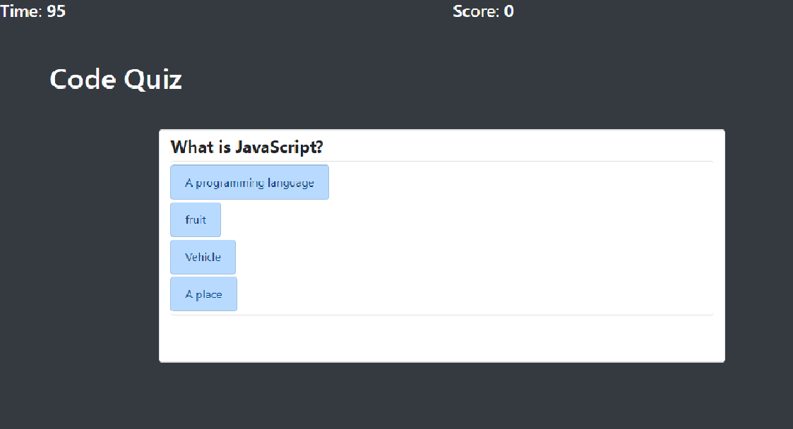
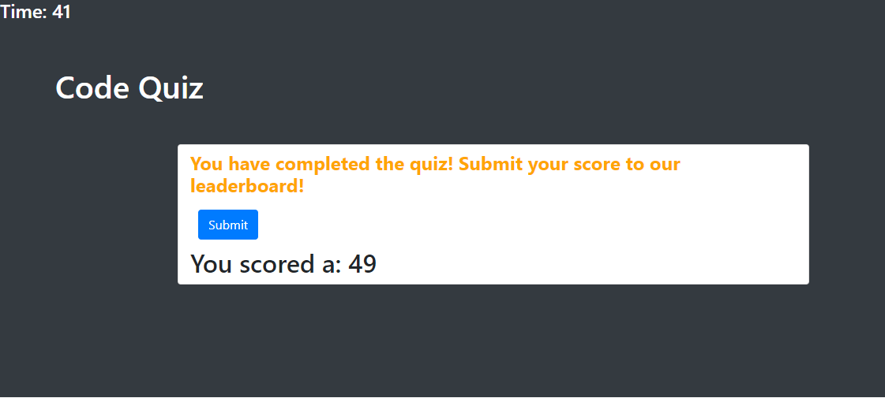

# Code_Quiz
For this task, I was asked to make a working JavaScript Coding quiz that is set on a timer with a selection of multiple choice questions.  The application is responsive through bootstrap css, and eas to use.

When the user clicks the start button the first question will appear and a timer will start (appearing at the top left).  For every questions the user gets right they will have 1 point added to their score and a some feedback text will appear saying whether or not the user got the answer correct.  If the user selects the wrong answer 10 seconds will be taken off the clock and the feedback text will say "wrong!"

upon completing the quiz the use will see their score (a combination of time and answers correct), and will have the option to submit their score.  The application will store locally their user name as prompted, and their score to the leader board.  A button wll appear to view the leaderboard.

To make this assignment work through Javascript I had to set multiple functions and click eventlisteners to path through the game in an order that made sense.  Begining with a start button that activated the game, as well as the timer.

My questions and answer were set through an array, that worked through intervals of that array, where the correct answer was identified in the array.  Using if statements I declared the conditions based on the users selection.

This assignement was very challenging, feel free to look through my process and try it out for yourself.

https://rseckman.github.io/Code_Quiz/
